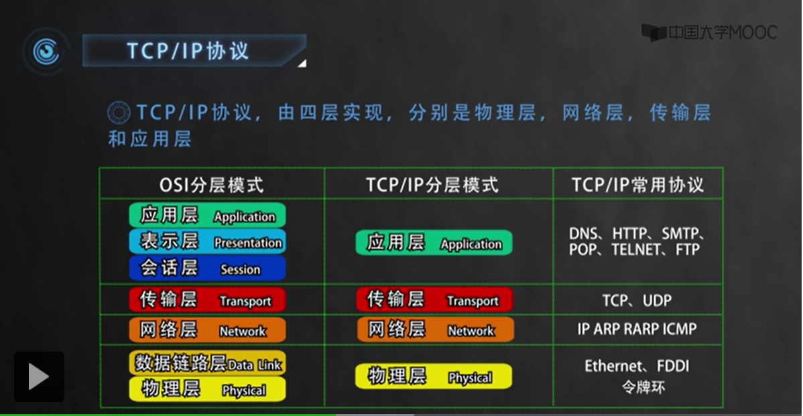

# HTTP 基础历史回顾
## HTTP 1.1 变更点

- PUT、DELETE
- 增加了缓存的manage和control
- 明确了连接管理，允许持久连接
- 允许响应数据分块（chunked），利于大文件传输
- 强制要求Host头，让互联网主机托管成为可能

>  在2014年，由于它（HTTP/1.1）太过于庞大和复杂，做了一次修订，原来的一个大文档变成了六份孝文帝，优化了一些细节，但此外没有任何实质性的改变。

## HTTP/2

HTTP/1.1 发布之后，整个互联网世界呈现出了爆发式的增长，度过了十多年的“快乐时光”，更涌现出了 Facebook、Twitter、淘宝、京东等互联网新贵。

Chrome出来了 =》 推出SPDY协议

最后在2015年出来了HPPT/2 

HTTP/2 的制定充分考虑了现今互联网的现状：宽带、移动、不安全，在高度兼容 HTTP/1.1 的同时在性能改善方面做了很大努力，主要的特点有：

- 二进制协议，不再是纯文本；
- 可发起多个请求，废弃了 1.1 里的管道；
- 使用专用算法压缩头部，减少数据传输量；
- 允许服务器主动向客户端推送数据；
- 增强了安全性，“事实上”要求加密通信。

即使HTTP2出来四五年了 而且还衍生出更多新协议（gRPC） 但是大多网站还是HTTP/1.1

HTTP0.9本来是没有版本号的 但是是为了区分1.0和1.1的版本，才在后来加上去的。

# HTTP是什么？

答： 超文本传输协议(Hyper Text Transfer Protocol)

协议>传输>超文本

## HTTP是一个协议

- 1. HTTP 是一个双向的**协议**

     > 也就是说 数据在双方中不是单向的 先发起传输的是**请求方**  后接受的是**应答方** 或者**响应方**
     >
     > 浏览器就是请求方 服务器就是应答方

- 2. 数据虽然是在A与B之间，但是组件可以有其他的东西中转和接力
     类似数据在路由器之间传输一样
     这些中间的接力的东西也要遵循HTTP协议，而且可以在不影响原有的基础数据传输上添加功能，例如安全认证、数据压缩、编码转换等等，优化整个传输过程。
**HTTP 是一个在计算机世界里专门用来在两点之间传输数据的约定和规范。**

- 3. 超文本
文本（Text） 就是字符文件，但是现在，**文本** 的意思可以是 图片、音频、视频、甚至是压缩包，在 HTTP 眼里都可以算做是“文本”。
超文本： 最关键的是含有“超链接”，**能够从一个“超文本”跳跃到另一个“超文本”**，形成复杂的**非线性、网状**的结构关系。

举例：HTML就是超文本，它以纯文件的形式，用标签定义了对图片、视频等链接，然后通过浏览器解析，就可以展示出基本的页面了。

**“HTTP 是一个在计算机世界里专门在两点之间传输文字、图片、音频、视频等超文本数据的约定和规范”。**

## HTTP 不是什么
- HTTP只是协议 不是APP不是Web服务等软件，应用
- HTTP不是编程软件

----
还有简版的地图

## 浏览器
> 浏览器本质上是一个 HTTP 协议中的请求方，使用 HTTP 协议获取网络上的各种资源。

HTML 排版引擎用来展示页面，JavaScript 引擎用来实现动态化效果，甚至还有开发者工具用来调试网页，以及五花八门的各种插件和扩展。

在 HTTP 协议里,浏览器的角色被称为“User Agent”,即“用户代理”
意思是作为访问者的“代理”来发起 HTTP 请求。
不过在不引起混淆的情况下，我们通常都简单地称之为“客户端”。

用户的浏览器是 HTTP 协议中的**请求方**
应答方 就是服务器 **Web Server **

 服务器分两个概念 硬件和软件
......

软件：
比如是说 后端的语言呐（PHP Nodejs Java Python） 服务器引擎呐（nginx，Apache）

## CDN

浏览器通常不会直接连到服务器，中间会经过 **“重重关卡”** ，其中的一个重要角色就叫做 CDN。

CDN 的用途：
- 可以根据用户的位置来改变请求的服务器地址
- 缓存源站数据
- 负载均衡

## 爬虫
···

# HTTP协议部分

简版的地图第二部分

## TCP/IP

> TCP/IP 协议是目前网络世界“事实上”的标准通信协议.TCP/IP 协议实际上是一系列网络通信协议的统称，其中最核心的两个协议是TCP和IP，其他的还有 UDP、ICMP、ARP 等等，共同构成了一个复杂但有层次的协议栈。

协议总共分为四层 最上是**应用层** 最下是**链接层** 。TCP和IP则在中间：

> TCP 属于 **“传输层”**，IP 属于 **“网络层”** 。

## IP(Internet Protocol)

目的：结局寻址和路由的问题。如何在两个（IP）之间传输数据包。IP协议用 **IP地址** 的概念来定位互联网上的每个计算机。

IP又分为两种 IPv4 和 IPv6
IPv4有大约42亿个地址，目前将近用完，但是v6的话，可以在未来几十年里面都够用了。但是v6还没普及。
## TCP(Transmission Control Protocol) 
> 传输控制协议.它 ***位于 IP 协议之上，基于 IP 协议提供可靠的、字节流形式的通信*** ，是 HTTP 协议得以实现的 **基础** 。

“可靠”是指保证数据不丢失
“字节流”是指保证数据 **完整**
所以在 TCP 协议的两端可以**如同操作文件一样访问传输的数据**，就像是读写在一个密闭的管道里“流动”的字节。

HTTP 是一个传输协议，但是它不关心关于 寻址 路由这些都是下层处理的东西。因为网络上TCP/IP协议最流行，所以HTTP协议就运行在了TCP/IP上。
HTTP 也就可以更准确地称为 **“HTTP over TCP/IP”** 。

# DNS
···

# HTTPS
它的全称是“HTTP over SSL/TLS”，也就是运行在 SSL/TLS 协议上的 HTTP。
