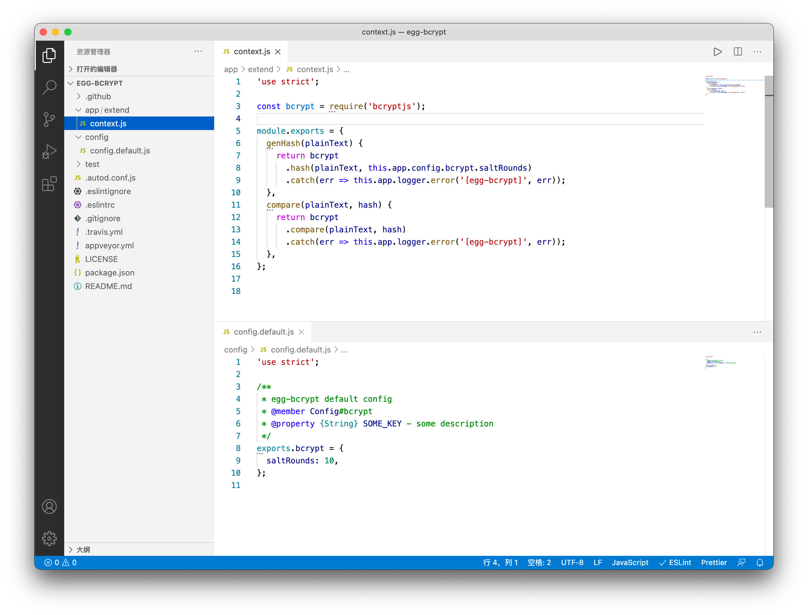
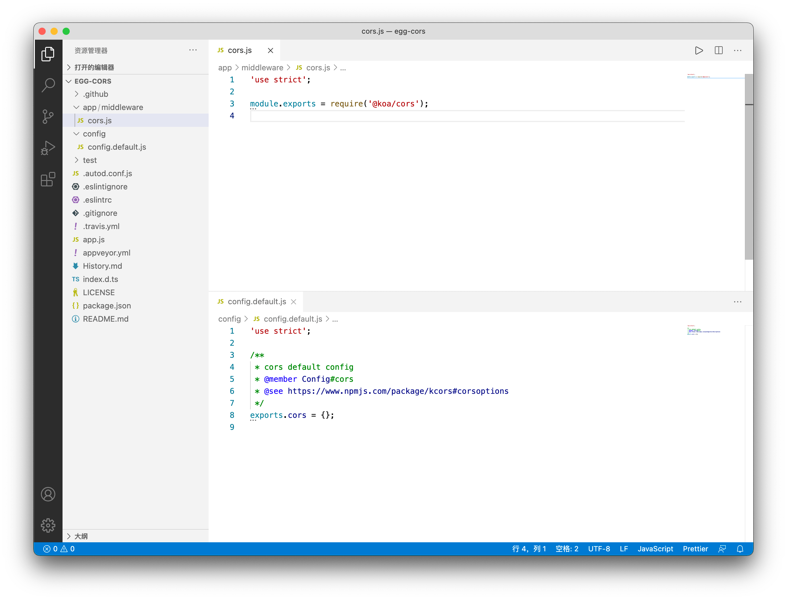
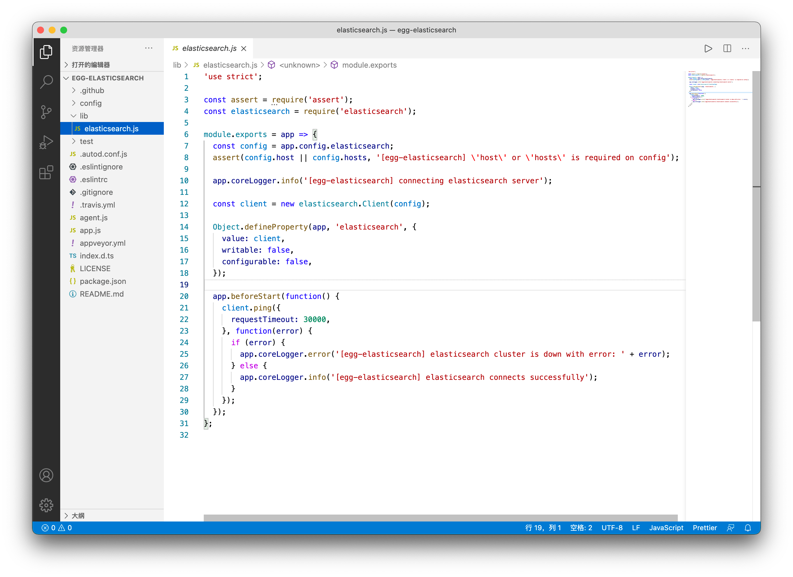

## 插件


上节课讲解模板渲染的时候，我们已经知道如何使用插件了，即只需要在应用或框架的 `config/plugin.js` 中声明：


```javascript
exports.myPlugin = {
  enable: true, // 是否开启
  package: 'egg-myPlugin', // 从 node_modules 中引入
  path: path.join(__dirname, '../lib/plugin/egg-mysql'), // 从本地目录中引入
  env: ['local', 'unittest', 'prod'], // 只有在指定运行环境才能开启
}
```


开启插件后，就可以使用插件提供的功能了：


```javascript
app.myPlugin.xxx()
```


如果插件包含需要用户自定义的配置，可以在 `config.default.js` 进行指定，例如：


```javascript
exports.myPlugin = {
  hello: 'world'
}
```


一个插件其实就是一个『迷你的应用』，包含了 [Service](https://eggjs.org/zh-cn/basics/service.html)、[中间件](https://eggjs.org/zh-cn/basics/middleware.html)、[配置](https://eggjs.org/zh-cn/basics/config.html)、[框架扩展](https://eggjs.org/zh-cn/basics/extend.html)等，但是没有独立的 [Router](https://eggjs.org/zh-cn/basics/router.html) 和 [Controller](https://eggjs.org/zh-cn/basics/controller.html)，也不能定义自己的 `plugin.js`。


在开发中必不可少要连接数据库，最实用的插件就是数据库集成的插件了。


### 集成 MongoDB


首先确保电脑中已安装并启动 MongoDB 数据库，如果是 Mac 电脑，可以用下面的命令快速安装和启动：


```sh
$ brew install mongodb-community
$ brew services start mongodb/brew/mongodb-community # 后台启动
# 或者使用 mongod --config /usr/local/etc/mongod.conf 前台启动
```


然后安装 [egg-mongoose](https://github.com/eggjs/egg-mongoose) 插件：


```sh
$ npm i egg-mongoose
# 或者 yarn add egg-mongoose
```


在 `config/plugin.js` 中开启插件：


```javascript
exports.mongoose = {
  enable: true,
  package: 'egg-mongoose',
}
```


在  `config/config.default.js` 中定义连接参数：


```javascript
config.mongoose = {
  client: {
    url: 'mongodb://127.0.0.1/example',
    options: {}
  }
}
```


然后在 `model/user.js`  中定义模型：


```javascript
module.exports = app => {
  const mongoose = app.mongoose
  const UserSchema = new mongoose.Schema(
    {
      username: {type: String, required: true, unique: true}, // 用户名
      password: {type: String, required: true}, // 密码
    },
    { timestamps: true } // 自动生成 createdAt 和 updatedAt 时间戳
  )
  return mongoose.model('user', UserSchema)
}
```


在控制器中调用 mongoose 的方法：


```javascript
const {Controller} = require('egg')

class UserController extends Controller {
  // 用户列表 GET /users
  async index() {
    const {ctx} = this
    ctx.body = await ctx.model.User.find({})
  }

  // 用户详情 GET /users/:id
  async show() {
    const {ctx} = this
    ctx.body = await ctx.model.User.findById(ctx.params.id)
  }

  // 创建用户 POST /users
  async create() {
    const {ctx} = this
    ctx.body = await ctx.model.User.create(ctx.request.body)
  }

  // 更新用户 PUT /users/:id
  async update() {
    const {ctx} = this
    ctx.body = await ctx.model.User.findByIdAndUpdate(ctx.params.id, ctx.request.body)
  }

  // 删除用户 DELETE /users/:id
  async destroy() {
    const {ctx} = this
    ctx.body = await ctx.model.User.findByIdAndRemove(ctx.params.id)
  }
}

module.exports = UserController
```


最后配置 RESTful 路由映射：


```javascript
module.exports = app => {
  const {router, controller} = app
  router.resources('users', '/users', controller.user)
}
```


### 集成 MySQL


首先确保电脑中已安装 MySQL 数据库，如果是 Mac 电脑，可通过下面的命令快速安装和启动：


```sh
$ brew install mysql
$ brew services start mysql # 后台启动
# 或者 mysql.server start 前台启动
$ mysql_secure_installation # 设置密码
```


官方有个 [egg-mysql](https://github.com/eggjs/egg-mysql) 插件，可以连接 MySQL 数据库，使用方法非常简单：


```sh
$ npm i egg-mysql
# 或者 yarn add egg-mysql
```


在 `config/plugin.js` 中开启插件：


```javascript
exports.mysql = {
  enable: true,
  package: 'egg-mysql',
}
```


在  `config/config.default.js` 中定义连接参数：


```javascript
config.mysql = {
  client: {
    host: 'localhost',
    port: '3306',
    user: 'root',
    password: 'root',
    database: 'cms',
  }
}
```


然后就能在 Controller 或 Service 的 `app.mysql` 中获取到 mysql 对象，例如：


```javascript
class UserService extends Service {
  async find(uid) {
    const user = await this.app.mysql.get('users', { id: 11 });
    return { user }
  }
}
```


如果启动的时候报错：


```
ERROR 5954 nodejs.ER_NOT_SUPPORTED_AUTH_MODEError: ER_NOT_SUPPORTED_AUTH_MODE: Client does not support authentication protocol requested by server; consider upgrading MySQL client
```


是因为你使用了 MySQL 8.x 版本，而 egg-mysql 依赖了 [ali-rds](https://github.com/ali-sdk/ali-rds) 这个包，这是阿里自己封装的包，里面又依赖了 [mysql](https://github.com/mysqljs/mysql) 这个包，而这个包已经废弃，不支持 caching_sha2_password 加密方式导致的。可以在 MySQL workbench 中运行下面的命令来解决：


```
ALTER USER 'root'@'localhost' IDENTIFIED WITH mysql_native_password BY 'password'
flush privileges
```


但是更好的集成 MySQL 的方式是借助 ORM 框架来帮助我们管理数据层的代码，[sequelize](http://docs.sequelizejs.com/) 是当前最流行的 ORM 框架，它支持 MySQL、PostgreSQL、SQLite 和 MSSQL 等多个数据源，接下来我们使用 [sequelize](http://docs.sequelizejs.com/) 来连接 MySQL 数据库，首先安装依赖：


```sh
npm install egg-sequelize mysql2 --save 
yarn add egg-sequelize mysql2
```


然后在 `config/plugin.js` 中开启 egg-sequelize 插件：


```javascript
exports.sequelize = {
  enable: true,
  package: 'egg-sequelize',
}
```


同样要在 `config/config.default.js` 中编写 sequelize 配置


```javascript
config.sequelize = {
  dialect: 'mysql',
  host: '127.0.0.1',
  port: 3306,
  database: 'example',
}
```


然后在 egg_example 库中创建 books 表：


```sql
CREATE TABLE `books` (
  `id` int(11) NOT NULL AUTO_INCREMENT COMMENT 'primary key',
  `name` varchar(30) DEFAULT NULL COMMENT 'book name',
  `created_at` datetime DEFAULT NULL COMMENT 'created time',
  `updated_at` datetime DEFAULT NULL COMMENT 'updated time',
  PRIMARY KEY (`id`)
) ENGINE=InnoDB DEFAULT CHARSET=utf8mb4 COMMENT='book';
```


创建 `model/book.js`  文件，代码是：


```javascript
module.exports = app => {
  const { STRING, INTEGER } = app.Sequelize
  const Book = app.model.define('book', {
    id: { type: INTEGER, primaryKey: true, autoIncrement: true },
    name: STRING(30),
  })
  return Book
}
```


添加 `controller/book.js` 控制器：


```javascript
const Controller = require('egg').Controller

class BookController extends Controller {
  async index() {
    const ctx = this.ctx
    ctx.body = await ctx.model.Book.findAll({})
  }

  async show() {
    const ctx = this.ctx
    ctx.body = await ctx.model.Book.findByPk(+ctx.params.id)
  }

  async create() {
    const ctx = this.ctx
    ctx.body = await ctx.model.Book.create(ctx.request.body)
  }

  async update() {
    const ctx = this.ctx
    const book = await ctx.model.Book.findByPk(+ctx.params.id)
    if (!book) return (ctx.status = 404)
    await book.update(ctx.request.body)
    ctx.body = book
  }

  async destroy() {
    const ctx = this.ctx
    const book = await ctx.model.Book.findByPk(+ctx.params.id)
    if (!book) return (ctx.status = 404)
    await book.destroy()
    ctx.body = book
  }
}

module.exports = BookController
```


最后配置 RESTful 路由映射：


```javascript
module.exports = app => {
  const {router, controller} = app
  router.resources('books', '/books', controller.book)
}
```


## 自定义插件


掌握了插件的使用，接下来就要讲讲如何自己写插件了，首先根据插件脚手架模板创建一个插件项目：


```sh
npm init egg --type=plugin
# 或者 yarn create egg --type=plugin
```


默认的目录结构为：


```
├── config
│   └── config.default.js
├── package.json
```


插件没有独立的 router 和 controller，并且需要在 `package.json` 中的 `eggPlugin` 节点指定插件特有的信息，例如：


```json
{
  "eggPlugin": {
    "name": "myPlugin",
    "dependencies": [ "registry" ],
    "optionalDependencies": [ "vip" ],
    "env": [ "local", "test", "unittest", "prod" ]
  }
}
```


上述字段的含义为：


- `name` - 插件名，配置依赖关系时会指定依赖插件的 name。
- `dependencies` - 当前插件强依赖的插件列表（如果依赖的插件没找到，应用启动失败）。
- `optionalDependencies` - 当前插件的可选依赖插件列表（如果依赖的插件未开启，只会 warning，不会影响应用启动）。
- `env` - 指定在某些运行环境才开启当前插件


那插件里面能做什么呢？


- 扩展内置对象：跟应用一样，在 `app/extend/` 目录下定义 `request.js`、`response.js` 等文件。
例如 [egg-bcrypt](https://github.com/yolopunk/egg-bcrypt) 库只是简单的对 `extend.js` 进行了扩展：

在项目中直接调用 `ctx.genHash(plainText)` 和 `ctx.compare(plainText, hash)` 即可。
- 插入自定义中间件：在 `app/middleware` 中写中间件，在 `app.js` 中使用
例如 [egg-cors](https://github.com/eggjs/egg-cors) 库就是定义了一个 `cors.js` 中间件，该中间件就是原封不动的用了 [koa-cors](https://github.com/koajs/cors)

直接在 `config/config.default.js` 中进行配置，例如：
```javascript
exports.cors = {
  origin: '*',
  allowMethods: 'GET,HEAD,PUT,POST,DELETE,PATCH'
}
```

- 在启动时做一些初始化工作：在 `app.js` 中添加同步或异步初始化代码
例如 [egg-elasticsearch](https://github.com/brucewar/egg-elasticsearch) 代码：

只是在启动前建立了一个 ES 连接而已，`beforeStart` 方法中还可以定义异步启动逻辑，虽然上面的代码是同步的，即用不用 `beforeStart` 封装都无所谓，但是如果有异步逻辑的话，可以封装一个 async 函数。
- 设置定时任务：在 `app/schedule/` 目录下添加定时任务，定时任务下一节会详细讲。


## 作业


本节介绍了如何集成 mongoose 和 sequelize + MySQL，请在你的项目中同时集成这两个插件，既可以连接到 MongoDB 又能连接到 MySQL。（注：这里有坑，具体可参考这个[issue](https://github.com/eggjs/egg/issues/805)）
